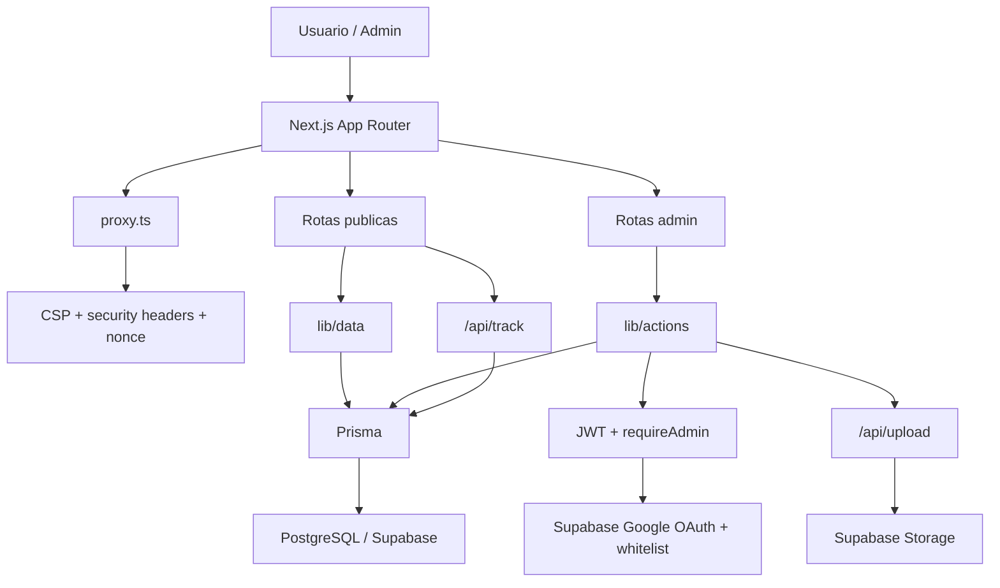

# Arquitetura do Sistema - Eliane Marques

Documento resumido da arquitetura atual do projeto.

## 1. Visao Geral



## 2. Camadas

### Frontend
- `app/(public)` contem as rotas publicas
- `components/ui` concentra o design system
- `components/shared` concentra navegacao e contato
- `components/features/home` concentra a home
- `components/features/home/HomeFaqAccordion.tsx` concentra o FAQ interativo

### Backoffice
- `app/(admin)/admin` contem login, dashboard e CRUD
- auth administrativa e Google-only
- sessao interna continua em `admin_session`

### Dados
- `lib/data` centraliza queries e cache
- `lib/institutional` centraliza `Config`, `About` e `Home`
- `lib/env` centraliza o contrato de ambiente
- `lib/core/theme-presets.ts` centraliza as paletas fechadas do site
- helpers puros de modulos criticos foram extraidos para arquivos dedicados quando o modulo principal depende de `server-only` ou Prisma

### Mutacoes
- `lib/actions/admin-crud.ts` centraliza produto, post e checklist
- `lib/institutional/*-actions.ts` centraliza singletons institucionais

### Analytics e leads
- eventos entram por `app/api/track/route.ts`
- persistencia em `AnalyticsEvent`
- historico agregado em `AnalyticsDailyAggregate`
- manutencao por `scripts/analytics-maintenance.mjs`
- lead capture persiste em `Lead`

### Midia
- upload autenticado em `app/api/upload/route.ts`
- producao usa Supabase Storage
- fallback local so fora de producao

## 3. Estrutura

```text
app/
  layout.tsx
  globals.css
  (public)/
  (admin)/admin/
  auth/admin/
  api/upload/
components/
  ui/
  shared/
  features/home/
  features/admin/
  features/checklist/
  features/products/
lib/
  actions/
  analytics/
  contact/
  core/
  data/
  env/
  institutional/
  server/
  supabase/
  utils/
  validators/
prisma/
  schema.prisma
  migrations/
  seed.ts
scripts/
  db-deploy.mjs
  analytics-maintenance.mjs
docs/
  *.md
```

## 4. Decisoes tecnicas relevantes

### Home publica
- `app/(public)/page.tsx` compoe a home por secoes
- o conteudo institucional da home vem de `lib/institutional/home.ts`
- o dominio `Home` persiste hero, imagem lateral do hero, audiencia, leitura de valor, metodo, FAQ e CTA final
- itens de audiencia, leitura de valor e metodo podem carregar imagem propria
- `Investimentos` e `Formatos` continuam dinamicos a partir de produtos ativos

### Tema global
- o tema do site e controlado por `themePreset` em `SiteConfig`
- `app/layout.tsx` aplica `data-theme` no elemento raiz
- `app/globals.css` resolve CSS variables por paleta e tambem tokens semanticos de superficie
- `app/(public)/layout.tsx` injeta `components/shared/layout/SiteAmbientCanvas.tsx` para continuidade visual entre secoes
- navegacao, navbar em scroll, hero, footer, overlays, sombras, botoes, toasts, catalogos publicos, paginas internas e login admin consomem esses tokens
- o admin escolhe apenas entre paletas fechadas; nao existe color picker livre

### Metadata publica
- `app/sitemap.ts` nao consulta mais Prisma diretamente
- posts, produtos e checklists para sitemap passam por `lib/data/*`
- a rota continua resiliente a falha de banco por usar `safeDataQuery` com fallback

### Testes e validacao
- E2E continua em `tests/e2e`
- cobertura unitaria leve agora existe em `tests/unit`
- a pipeline `validate.yml` roda lint, unit tests, typecheck e build com ambiente sintetico em Linux

### CTA de produto
- regra central em `lib/core/product-cta.ts`
- nao espalhar regra comercial fora desse modulo

### WhatsApp
- regra central em `lib/contact/whatsapp-intents.ts`
- componentes nao devem montar links diretamente

### Migrations
- `npm run db:deploy` usa `scripts/db-deploy.mjs`
- tenta `prisma migrate deploy`
- cai para fallback SQL controlado se o engine falhar localmente

### Auth admin
- Google OAuth via Supabase
- whitelist por `ADMIN_GOOGLE_ALLOWED_EMAILS`
- sem fallback por senha

## 5. Riscos arquiteturais atuais

### Criticos
- a credencial de storage do Supabase continua sendo pendencia operacional se houve exposicao previa
- o build ainda depende de um Prisma Client gerado, mas as queries publicas protegidas por fallback nao bloqueiam mais a compilacao sem banco

### Importantes
- endpoints publicos sensiveis falham fechado em producao se Redis estiver indisponivel
- nao existe suite de testes unitarios para regras criticas
- a home publica ja esta publicada, mas ainda depende de refinamento visual/comercial continuo
- o build ainda depende de Prisma Client gerado localmente, embora o runner resiliente ja trate o lock do engine no Windows

## 6. Regras de evolucao
- manter Server Components por padrao
- usar Client Components apenas quando houver estado ou efeito real
- nao espalhar regra de produto fora de `lib/core/product-cta.ts`
- nao espalhar links de WhatsApp fora de `lib/contact/whatsapp-intents.ts`
- nao depender de `public/uploads` como storage final em producao
- concentrar futuros singletons institucionais em `lib/institutional/*`
- manter a home CMS-driven apenas para conteudo; layout e comportamento visual continuam no codigo
