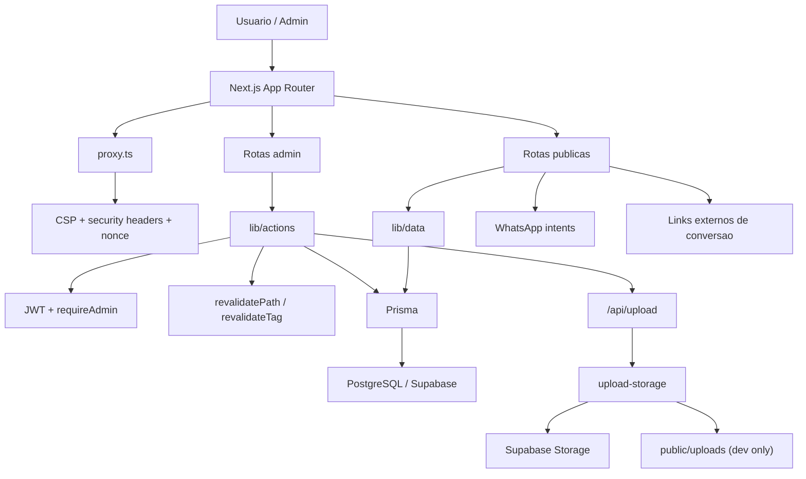

# Arquitetura do Sistema - Eliane Marques

Documento resumido da arquitetura atual do projeto apos estabilizacao tecnica, ajustes de seguranca e padronizacao de UX.

## 1. Visao Geral

O projeto segue um modelo server-first com Next.js App Router:
- leitura de dados no servidor
- mutacoes via Server Actions
- client components apenas em pontos de interatividade real
- proxy centralizando auth e headers de seguranca



## 2. Camadas da Aplicacao

### Frontend
- `app/(public)` contem as rotas publicas
- `components/ui` concentra o design system
- `components/shared` contem navegacao, WhatsApp e a carga de Material Symbols
- `components/features/home` contem as secoes da home

### Backoffice
- `app/(admin)/admin` contem login, dashboard e CRUD
- protecao de sessao por cookie JWT
- login exige Upstash configurado em producao

### Dados
- `lib/data` centraliza queries e cache
- `safeDataQuery` trata falhas com fallback controlado
- `getSiteConfigs()` usa `unstable_cache`
- `getSiteIdentity()` usa `cache`

### Mutacoes
- `lib/actions/admin-crud.ts` centraliza upsert/delete de produto, post e checklist
- apos mutacao, listagens e paginas de detalhe sao revalidadas
- produtos persistem estrategia de conversao:
  - `ctaMode`
  - `ctaUrl`
  - `ctaLabel`

### Midia
- upload autenticado em `app/api/upload/route.ts`
- provider em `lib/server/upload-storage.ts`
- drivers:
  - `supabase` em producao
  - `local` apenas fora de producao

### Seguranca
- `proxy.ts` aplica:
  - CSP dinamica com nonce
  - `X-Frame-Options`
  - `X-Content-Type-Options`
  - `Referrer-Policy`
  - `Permissions-Policy`
  - HSTS em producao
- `lib/server/production-guards.ts` valida requisitos de producao

## 3. Estrutura Atual

```text
app/
  layout.tsx
  globals.css
  icon.svg
  (public)/
  (admin)/admin/
  api/upload/
components/
  ui/
  shared/
  features/home/
  features/admin/
  features/checklist/
  features/products/
lib/
  actions/
  contact/
  core/
  data/
  server/
  utils/
  validators/
prisma/
  schema.prisma
  migrations/
  seed.ts
scripts/
  db-deploy.mjs
docs/
  *.md
```

## 4. Decisoes Tecnicas Relevantes

### 4.1 Home componentizada
A rota `app/(public)/page.tsx` e composicao de:
- `HeroSection`
- `IdentitySection`
- `ProfileTracksSection`
- `MethodSection`
- `ServicesSection`
- `PricingSection`
- `FaqSection`
- `FinalCtaSection`

### 4.2 URLs de produto centralizadas
As URLs publicas de detalhe de produto sao definidas por `lib/core/product-paths.ts`.

Regra atual:
- `CONSULTORIA` -> `/servicos/[slug]`
- `CURSO` -> `/cursos/[slug]`
- `EBOOK` e `CHECKLIST` -> `/materiais/[slug]`

### 4.3 CTA de produto centralizado
O destino principal de conversao por produto foi centralizado em `lib/core/product-cta.ts`.

### 4.4 Intent layer para WhatsApp
Componentes nao montam mais URLs de WhatsApp diretamente via helper bruto.

Camada atual:
- `lib/contact/whatsapp-intents.ts`

### 4.5 Pipeline de imagem
As imagens publicas usam `next/image` com otimizacao quando a origem permite.

Helper central:
- `lib/core/images.ts`

### 4.6 Migrations resilientes
`npm run db:deploy` usa `scripts/db-deploy.mjs`.

Fluxo:
1. tenta `prisma migrate deploy`
2. em falha do schema engine local, aplica fallback SQL controlado

### 4.7 Tipografia e icones
- fontes principais em `next/font`
- `Material Symbols` continua externa, mas agora usa preload + injecao client-side

## 5. Riscos Arquiteturais Atuais

### Criticos
- a credencial de storage do Supabase continua sendo pendencia operacional se houver exposicao previa
- build continua dependente de banco acessivel

### Importantes
- analytics ainda nao existe
- `Material Symbols` ainda depende de CDN

## 6. Regras de Evolucao
- manter Server Components por padrao
- usar Client Components apenas quando houver estado/efeito real
- nao espalhar regra de URL de produto fora de `getProductDetailPath()`
- nao espalhar regra de CTA fora de `lib/core/product-cta.ts`
- nao espalhar montagem de WhatsApp fora de `lib/contact/whatsapp-intents.ts`
- nao depender de `public/uploads` como storage final em producao

## 7. Estado Atual

Resolvido na rodada recente:
- contraste e legibilidade base
- pipeline de imagem
- favicon
- endurecimento de CSP
- obrigatoriedade de storage persistente em producao
- obrigatoriedade de rate limit distribuido em producao
- fallback resiliente de migrations
- home componentizada
- intents de WhatsApp centralizadas
- cache explicito de identidade do site
- CTA por produto configuravel no admin

Pendente:
- analytics de conversao
- eventual migracao de icones para bundle local
