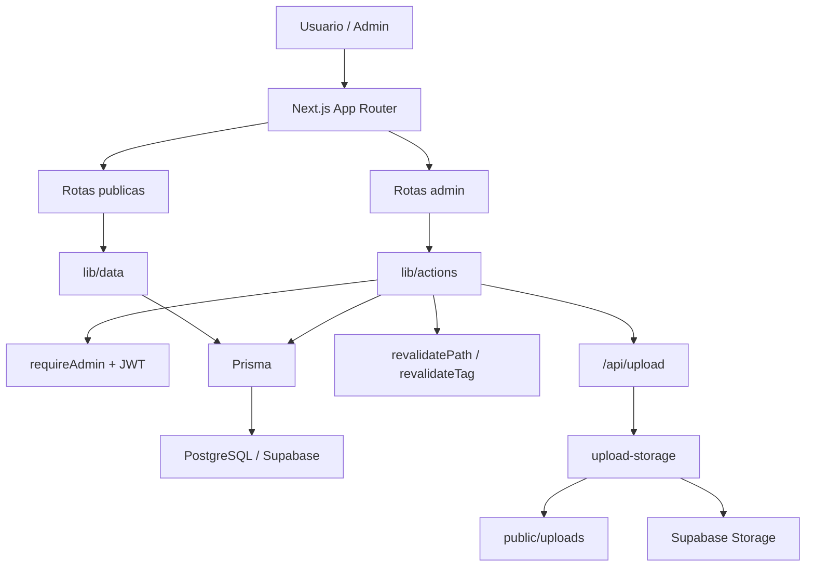

# Arquitetura do Sistema - Eliane Marques

Este documento resume a arquitetura atual do projeto apos a rodada de estabilizacao tecnica realizada em 11/03/2026.

## 1. Visao Geral

O projeto segue um modelo server-first com Next.js App Router:
- leitura de dados no servidor
- mutacoes via Server Actions
- client components apenas em pontos de interatividade real



## 2. Camadas da Aplicacao

### Frontend
- `app/(public)` contem as rotas publicas
- `components/ui` concentra o design system
- `components/shared` contem navegacao e WhatsApp
- `components/features/home` contem as secoes da home

### Backoffice
- `app/(admin)/admin` contem login, dashboard e CRUD
- protecao de sessao por cookie JWT
- rate limit no login com Upstash + fallback local

### Dados
- `lib/data` centraliza queries e cache
- `safeDataQuery` trata falhas com fallback controlado
- dados publicos usam `revalidate = 300` e tags especificas em pontos selecionados

### Mutacoes
- `lib/actions/admin-crud.ts` centraliza upsert/delete de produto, post e checklist
- apos mutacao, as listagens e as paginas de detalhe sao revalidadas
- produtos agora persistem tambem a estrategia de conversao:
  - `ctaMode`
  - `ctaUrl`
  - `ctaLabel`

### Midia
- upload autenticado em `app/api/upload/route.ts`
- provider em `lib/server/upload-storage.ts`
- drivers:
  - `supabase`
  - `local`

## 3. Estrutura Atual

```text
app/
  (public)/
  (admin)/admin/
  api/upload/
components/
  ui/
  shared/
  features/
lib/
  actions/
  core/
  data/
  server/
  validators/
prisma/
docs/
```

## 4. Decisoes Tecnicas Relevantes

### 4.1 Home componentizada
A rota `app/(public)/page.tsx` hoje e apenas composicao. As secoes foram extraidas para:
- `HeroSection`
- `IdentitySection`
- `ProfileTracksSection`
- `MethodSection`
- `ServicesSection`
- `PricingSection`
- `FaqSection`
- `FinalCtaSection`

### 4.2 URLs de produto centralizadas
As URLs publicas de detalhe de produto sao definidas por `lib/core/product-paths.ts`.

Regra atual:
- `CONSULTORIA` -> `/servicos/[slug]`
- `CURSO` -> `/cursos/[slug]`
- `EBOOK` e `CHECKLIST` -> `/materiais/[slug]`

Isso tambem alimenta:
- links internos
- canonical
- sitemap
- revalidacao de detalhe

### 4.2.1 CTA de produto centralizado
O destino principal de conversao por produto foi centralizado em `lib/core/product-cta.ts`.

Regra atual:
- `ctaMode=WHATSAPP` -> CTA usa WhatsApp
- `ctaMode=EXTERNAL` + `ctaUrl` -> CTA usa link externo
- cards de `CURSO` e `EBOOK/CHECKLIST` mantem fallback para pagina de detalhe quando nao ha link externo

Isso alimenta:
- `ProductDetailView`
- listagem de `servicos`
- listagem de `cursos`
- listagem de `materiais`

### 4.3 Pipeline de imagem
As imagens publicas usam `next/image` com otimizacao quando a origem permite.

Helper central:
- `lib/core/images.ts`

Origem considerada otimizavel:
- caminhos locais
- `images.unsplash.com`
- host do Supabase definido em `SUPABASE_URL`

### 4.4 Tipografia
As fontes principais foram migradas para `next/font` em `app/layout.tsx`.

Ainda externo:
- `Material Symbols Outlined`

### 4.5 Storage
O sistema de upload ja suporta storage persistente, mas o deploy precisa ter as variaveis de ambiente configuradas para sair do fallback local.

## 5. Fluxo de Conteudo

### Leitura
1. rota publica chama `lib/data/*`
2. query usa Prisma
3. resultado e cacheado conforme estrategia da rota

### Escrita
1. admin envia formulario
2. server action valida com Zod
3. Prisma persiste
4. `runAdminMutation` revalida listagens e detalhes

## 6. Riscos Arquiteturais Atuais

### Criticos
- storage persistente ainda depende de configuracao operacional
- build falha sem banco acessivel

### Importantes
- analytics ainda nao existe
- Material Symbols ainda depende de CDN
- documentacao auxiliar estava atrasada e esta sendo atualizada

## 7. Regras de Evolucao
- manter Server Components por padrao
- usar Client Components apenas com necessidade real de estado ou efeito
- nao espalhar regra de URL de produto fora de `getProductDetailPath()`
- nao reintroduzir `unoptimized` em paginas publicas sem justificativa
- nao depender de `public/uploads` como storage final em producao

## 8. Estado Atual

Resolvido na rodada recente:
- contraste e legibilidade base
- pipeline de imagem
- sitemap e URLs por tipo
- fontes via `next/font`
- revalidacao de paginas de detalhe
- home componentizada
- loading e toasts alinhados ao design system
- CTA por produto configuravel no admin

Pendente:
- analytics de conversao
- rollout operacional final de storage persistente
