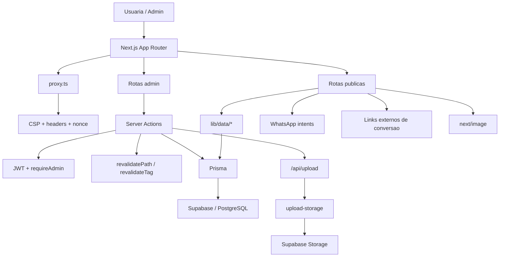

# Documentacao Tecnica - Eliane Marques Website
**Versao:** 1.3  
**Data:** 12/03/2026  
**Responsavel pela analise:** Codex AI  
**Status do projeto:** Producao / manutencao ativa

## Indice
- [1. Visao Geral do Projeto](#1-visao-geral-do-projeto)
- [2. Estrutura do Projeto](#2-estrutura-do-projeto)
- [3. Componentes e Secoes](#3-componentes-e-secoes)
- [4. Integracoes Externas](#4-integracoes-externas)
- [5. Performance e SEO Tecnico](#5-performance-e-seo-tecnico)
- [6. Responsividade e Mobile](#6-responsividade-e-mobile)
- [7. Pontos Criticos de Melhoria](#7-pontos-criticos-de-melhoria)
- [8. Roadmap Tecnico Recomendado](#8-roadmap-tecnico-recomendado)
- [9. Guia de Manutencao](#9-guia-de-manutencao)
- [10. Decisoes de Design Tecnico](#10-decisoes-de-design-tecnico)
- [11. Glossario do Projeto](#11-glossario-do-projeto)
- [12. Historico de Versoes](#12-historico-de-versoes)
- [13. Divida Tecnica Geral](#13-divida-tecnica-geral)

---

## 1. VISAO GERAL DO PROJETO

### 1.1 Descricao
- Site comercial e editorial da marca Eliane Marques para consultoria de imagem, etiqueta corporativa, cursos, materiais digitais e checklists.
- Objetivo de negocio: converter para contato via WhatsApp, venda direta externa (ex.: Hotmart) e sustentar a oferta de servicos premium.
- Publico tecnico: frontend, full-stack, QA e manutencao operacional.
- URL de producao: `https://v03-pink.vercel.app`
- Hospedagem identificavel: Vercel + PostgreSQL/Supabase.

### 1.2 Stack Tecnologico

| Camada | Tecnologia | Versao | Observacao |
|---|---|---:|---|
| Framework | Next.js App Router | 16.1.6 | RSC, metadata nativa, ISR |
| UI | React | 19.2.x | Client components so onde necessario |
| Linguagem | TypeScript | 5.x | Tipagem total |
| CSS | Tailwind CSS | 4.1.18 | Tokens em `globals.css` |
| ORM | Prisma | 5.22.0 | PostgreSQL |
| Banco | PostgreSQL | n/a | Supabase |
| Auth admin | `jose` JWT | 6.1.3 | Cookie `admin_session` |
| Validacao | Zod | 4.3.6 | Admin e formularios |
| Rate limit | Upstash Redis REST | 1.35.6 | Obrigatorio em producao para login |
| Testes | Playwright | 1.58.2 | E2E |
| Fontes | `next/font` | n/a | Playfair, Jost e Cormorant |
| Icones | Material Symbols | n/a | Externo, preload + injecao client-side |
| Upload | API Next + Supabase Storage | n/a | Fallback local so fora de producao |
| CTA por produto | configuracao persistida em banco | n/a | `ctaMode`, `ctaUrl`, `ctaLabel` |
| Analytics | Nao implementado | n/a | BT-009 pendente |

### 1.3 Diagrama de Arquitetura



---

## 2. ESTRUTURA DO PROJETO

### 2.1 Arvore de Arquivos

```text
app/
  layout.tsx
  globals.css
  icon.svg
  api/upload/route.ts
  (public)/
  (admin)/admin/
components/
  ui/
  shared/
  features/home/
  features/admin/
  features/checklist/
  features/products/
lib/
  actions/
  contact/
  core/
  data/
  server/
  utils/
  validators/
prisma/
  schema.prisma
  migrations/
  seed.ts
scripts/
  db-deploy.mjs
docs/
  *.md
```

### 2.2 Padroes de Nomenclatura
- Componentes: `PascalCase.tsx`
- Helpers e modulos: `kebab-case.ts`
- Funcoes e variaveis: `camelCase`
- Rotas: portugues lowercase
- CSS: Tailwind utility-first + classes semanticas globais

### 2.3 Sistema de Design Implementado
- Tokens principais em `app/globals.css`
- Tipografia:
  - Playfair Display
  - Jost
  - Cormorant Garamond
- Breakpoints:
  - `sm 640`
  - `md 768`
  - `lg 1024`
  - `xl 1280`
  - `2xl 1536`

---

## 3. COMPONENTES E SECOES

### 3.1 Navbar / Header
- **Localizacao:** `components/shared/navigation/Navbar.tsx`, `MobileNav.tsx`
- **Descricao:** navbar sticky com CTA principal e acesso ao admin.
- **Problema identificado:** `Material Symbols` ainda depende de recurso externo.
- **Sugestao de melhoria:** migrar icones para bundle local.

**Acoes para este componente**
- Medir navegacao por breakpoint quando analytics existir.

### 3.2 Hero Section
- **Localizacao:** `components/features/home/HeroSection.tsx`
- **Descricao:** headline principal, subtitulo, metricas e CTA.
- **Sugestao de melhoria:** manter teste visual regressivo.

**Acoes para este componente**
- Testar leitura da headline e do subtitulo em mobile pequeno.

### 3.3 Secoes da Home
- **Localizacao:** `components/features/home/*`
- **Descricao:** home composta por seções dedicadas.
- **Problema identificado:** featured comercial ainda depende de indice em algumas secoes.
- **Sugestao de melhoria:** externalizar destaque comercial.

**Acoes para este componente**
- Evoluir configuracao de featured quando isso virar requisito real.

### 3.4 WhatsApp Buttons / Links
- **Localizacao:** `components/shared/whatsapp/*`, `lib/contact/whatsapp-intents.ts`
- **Descricao:** CTAs contextuais com fallback de abertura e camada unica de intents.
- **Problema identificado:** sem analytics de clique.
- **Sugestao de melhoria:** instrumentar no BT-009.

**Acoes para este componente**
- Registrar clique e origem da CTA no futuro.

### 3.5 Checklist Interativa
- **Localizacao:** `components/features/checklist/*`
- **Descricao:** checklist com progresso persistido em `localStorage`.
- **Problema identificado:** nenhum critico apos correcao de IDs orfaos.
- **Sugestao de melhoria:** medir taxa de conclusao.

**Acoes para este componente**
- Instrumentar eventos quando analytics entrar.

### 3.6 Admin / Upload / CRUD
- **Localizacao:** `app/(admin)/admin/*`, `components/features/admin/*`, `lib/actions/admin-crud.ts`
- **Descricao:** backoffice de gestao do conteudo.
- **Problema identificado:** operacao ainda depende de configuracao segura de credenciais.
- **Sugestao de melhoria:** manter checklist operacional de deploy.

**Acoes para este componente**
- Validar ambiente antes de qualquer alteracao critica.

### 3.7 CTA de Produto
- **Localizacao:** `app/(admin)/admin/produtos/ProductForm.tsx`, `lib/core/product-cta.ts`, `components/features/products/ProductDetailView.tsx`
- **Descricao:** cada produto pode escolher entre CTA via WhatsApp ou link externo, com rotulo customizavel.
- **Dependencias:** colunas `ctaMode`, `ctaUrl`, `ctaLabel` na tabela `Product`.
- **Sugestao de melhoria:** conectar com telemetria futura.

**Acoes para este componente**
- Usar `ctaMode=EXTERNAL` apenas com URL valida preenchida.
- Centralizar qualquer nova regra comercial em `lib/core/product-cta.ts`.

---

## 4. INTEGRACOES EXTERNAS

### 4.1 Supabase Storage / PostgreSQL
- **Tipo:** banco e storage
- **Implementacao:** Prisma + driver de upload em `lib/server/upload-storage.ts`
- **Configuracao:** `DATABASE_URL`, `DIRECT_URL`, `SUPABASE_URL`, `SUPABASE_SERVICE_ROLE_KEY`, `SUPABASE_STORAGE_BUCKET`
- **Risco:** credencial de storage continua dependente de operacao segura

### 4.2 Upstash Redis
- **Tipo:** rate limiting
- **Implementacao:** REST API
- **Configuracao:** `UPSTASH_REDIS_REST_URL`, `UPSTASH_REDIS_REST_TOKEN`
- **Observacao:** em producao e obrigatorio para login

### 4.3 WhatsApp
- **Tipo:** conversao
- **Implementacao:** deep link `wa.me` / `api.whatsapp.com`

### 4.4 Links externos por produto
- **Tipo:** conversao / checkout externo
- **Implementacao:** configuracao persistida no `Product`

### 4.5 Material Symbols
- **Tipo:** icones
- **Implementacao:** preload + stylesheet injetada em client component
- **Risco:** dependencia residual de CDN

---

## 5. PERFORMANCE E SEO TECNICO

### 5.1 Analise de Performance
- fontes principais em `next/font`
- `Material Symbols` ainda externa, mas sem carregamento bloqueante direto
- imagens publicas usam otimizacao condicional via helper central
- favicon resolvido em `app/icon.svg`
- build validado em producao e local

### 5.2 SEO Tecnico
- metadata nativa configurada
- Open Graph e Twitter cards presentes
- `Organization` JSON-LD no layout raiz
- sitemap e robots implementados
- detalhes de produto usam helper unico `getProductDetailPath()`

### 5.3 Acessibilidade (WCAG)
- foco visivel global implementado
- contraste melhorado, mas ainda depende de auditoria formal
- score estimado atual: **A / AA parcial**

---

## 6. RESPONSIVIDADE E MOBILE

### 6.1 Breakpoints Documentados

| Breakpoint | Valor (px) | Target | Definido em |
|---|---:|---|---|
| `sm` | 640 | mobile grande | Tailwind |
| `md` | 768 | tablet retrato | Tailwind |
| `lg` | 1024 | tablet paisagem | Tailwind |
| `xl` | 1280 | desktop | Tailwind |

### 6.2 Analise por Secao
- home componentizada e mais facil de ajustar por viewport
- catalogos publicos usam paginacao
- detalhes usam layout adaptativo
- admin tem navegacao mobile propria

### 6.3 Touch e Interatividade Mobile
- hover existe, mas a experiencia base nao depende dele
- pontos que ainda pedem QA recorrente:
  - CTA do topo
  - paginacao
  - FAQ
  - navegacao em telas 1024-1279

---

## 7. PONTOS CRITICOS DE MELHORIA

### 7.1 Criticos - Resolver Imediatamente

#### 7.1.1 Analytics de conversao ainda inexistente
- **Problema:** nao ha telemetria para CTA, WhatsApp e links externos.
- **Impacto:** o produto opera sem visibilidade de conversao.
- **Solucao recomendada:** executar BT-009.

#### 7.1.2 Credencial sensivel do Supabase permanece pendencia operacional
- **Problema:** a seguranca definitiva desse ponto depende de operacao externa.
- **Impacto:** risco residual na camada de storage.
- **Solucao recomendada:** rotacao operacional da credencial.

### 7.2 Importantes - Resolver em Breve

#### 7.2.1 Material Symbols ainda depende de CDN
- **Solucao recomendada:** migrar para bundle local.

#### 7.2.2 Featured comercial ainda e fixo por indice
- **Solucao recomendada:** tornar configuravel.

---

## 8. ROADMAP TECNICO RECOMENDADO

### 8.1 Fase 1 - Estabilizacao (0-30 dias)

| Tarefa | Area | Esforco | Impacto | Responsavel sugerido |
|---|---|---|---|---|
| Implementar analytics de conversao | Growth | Medio | Alto | Full-stack |
| Rotacionar credencial sensivel do Supabase | Infra | Baixo | Alto | Operacao / Owner |
| QA manual recorrente em rotas criticas | QA | Baixo | Medio | Frontend / QA |

### 8.2 Fase 2 - Otimizacao (30-90 dias)

| Tarefa | Area | Esforco | Impacto | Responsavel sugerido |
|---|---|---|---|---|
| Migrar icones para bundle local | Performance | Baixo | Medio | Frontend |
| Featured comercial configuravel | Conteudo | Baixo | Medio | Full-stack |
| Schema estruturado adicional | SEO | Medio | Medio | Frontend / Full-stack |

### 8.3 Fase 3 - Escala (90-180 dias)

| Tarefa | Area | Esforco | Impacto | Responsavel sugerido |
|---|---|---|---|---|
| Dashboard comercial no admin | Produto | Medio | Alto | Full-stack |
| CRM ou formulario estruturado | Produto | Medio | Medio | Full-stack |
| Lighthouse / acessibilidade automatizada | Qualidade | Medio | Medio | QA / Frontend |

---

## 9. GUIA DE MANUTENCAO

### 9.1 Como Fazer Alteracoes Seguras
- textos da home: `components/features/home/*`
- conteudo dinamico: admin
- cores: `app/globals.css`
- fontes: `app/layout.tsx` via `next/font`
- WhatsApp: `lib/contact/whatsapp-intents.ts`
- CTA de produto: `lib/core/product-cta.ts`

```bash
npm.cmd run lint
npx.cmd tsc --noEmit
npm.cmd run build
npm.cmd run test:e2e
```

### 9.2 O Que NAO Fazer
- nao depender de `public/uploads` como storage final de producao
- nao espalhar regra de URLs de produto fora de `getProductDetailPath()`
- nao espalhar regra de destino de CTA fora de `lib/core/product-cta.ts`
- nao espalhar montagem de WhatsApp fora de `lib/contact/whatsapp-intents.ts`
- nao reintroduzir `unoptimized` sem necessidade real

### 9.3 Checklist de Deploy
- [ ] `lint` sem erros
- [ ] `tsc --noEmit` sem erros
- [ ] `build` com banco acessivel
- [ ] variaveis de banco e auth configuradas
- [ ] `SUPABASE_*` configuradas em producao
- [ ] `UPSTASH_*` configuradas em producao
- [ ] `NEXT_PUBLIC_SITE_URL` correta

---

## 10. DECISOES DE DESIGN TECNICO

### 10.1 Sistema de Cores
- tokens em `app/globals.css`
- documentacao detalhada em `docs/DESIGN_TOKENS.md`

### 10.2 Tipografia Tecnica
- Playfair Display
- Jost
- Cormorant Garamond
- Material Symbols

### 10.3 Animacoes Catalogadas
- `fade-up`
- `nav-underline`
- shimmer do botao primario

---

## 11. GLOSSARIO DO PROJETO
- **Home / Landing:** rota principal
- **Servicos:** produtos `CONSULTORIA`
- **Cursos:** produtos `CURSO`
- **Materiais:** produtos `EBOOK` e `CHECKLIST`
- **Funil WhatsApp:** principal fluxo de conversao
- **CTA externo:** botao de produto apontando para checkout externo
- **Intent de WhatsApp:** helper central que monta URL contextual
- **Admin:** backoffice protegido em `/admin`

---

## 12. HISTORICO DE VERSOES

| Versao | Data | Autor | Descricao das mudancas |
|---|---|---|---|
| 1.0 | 11/03/2026 | Codex AI | Documentacao inicial gerada por analise automatizada |
| 1.1 | 11/03/2026 | Codex AI | Documento atualizado apos execucao do backlog BT-001 a BT-010 |
| 1.2 | 11/03/2026 | Codex AI | Documento atualizado com CTA por produto configuravel |
| 1.3 | 12/03/2026 | Codex AI | Documento atualizado para refletir seguranca endurecida, fallback de migrations, intent layer de WhatsApp, favicon, cache explicito e estado real de producao |

---

## 13. DIVIDA TECNICA GERAL

**Nivel estimado:** Medio

**Justificativa:**
- a base tecnica esta estavel e mais limpa;
- itens centrais ja resolvidos: CSP, auth, storage em producao, rate limit em producao, pipeline de imagem, componentizacao da home, cache de identidade, intents de contato e padronizacao do admin;
- os riscos remanescentes estao concentrados em:
  - analytics inexistente;
  - dependencia residual de icones externos;
  - pendencia operacional de credencial sensivel do Supabase.
