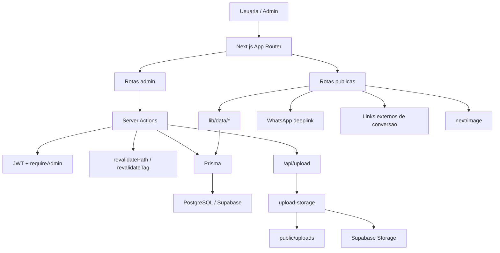

# Documentacao Tecnica - Eliane Marques Website
**Versao:** 1.2  
**Data:** 11/03/2026  
**Responsavel pela analise:** Codex AI  
**Status do projeto:** Manutencao ativa

## Indice
- [1. Visao Geral do Projeto](#1-visao-geral-do-projeto)
- [2. Estrutura do Projeto](#2-estrutura-do-projeto)
- [3. Componentes e Secoes](#3-componentes-e-secoes)
- [4. Integracoes Externas](#4-integracoes-externas)
- [5. Performance e SEO Tecnico](#5-performance-e-seo-tecnico)
- [6. Responsividade e Mobile](#6-responsividade-e-mobile)
- [7. Pontos Criticos de Melhoria](#7-pontos-criticos-de-melhoria)
- [8. Roadmap Tecnico Recomendado](#8-roadmap-tecnico-recomendado)
- [9. Guia de Manutencao](#9-guia-de-manutencao)
- [10. Decisoes de Design Tecnico](#10-decisoes-de-design-tecnico)
- [11. Glossario do Projeto](#11-glossario-do-projeto)
- [12. Historico de Versoes](#12-historico-de-versoes)
- [13. Divida Tecnica Geral](#13-divida-tecnica-geral)

---

## 1. VISAO GERAL DO PROJETO

### 1.1 Descricao
- Site comercial e editorial da marca Eliane Marques para consultoria de imagem, etiqueta corporativa, cursos, materiais digitais e checklists.
- Objetivo de negocio: converter para contato via WhatsApp, venda direta externa (ex.: Hotmart) e sustentar a oferta de servicos premium.
- Publico tecnico: frontend, full-stack, QA e manutencao operacional.
- URL de producao: `Informacao insuficiente - requer revisao manual pelo time`.
- Hospedagem identificavel: arquitetura compativel com Vercel + PostgreSQL/Supabase.

### 1.2 Stack Tecnologico

| Camada | Tecnologia | Versao | Observacao |
|---|---|---:|---|
| Framework | Next.js App Router | 16.1.6 | RSC, metadata nativa, ISR |
| UI | React | 19.2.0 | Client components so onde necessario |
| Linguagem | TypeScript | 5.x | Tipagem total |
| CSS | Tailwind CSS | 4.1.18 | Tokens em `globals.css` |
| ORM | Prisma | 5.22.0 | PostgreSQL |
| Banco | PostgreSQL | n/a | Local e Supabase |
| Auth admin | `jose` JWT | 6.1.3 | Cookie `admin_session` |
| Validacao | Zod | 4.3.6 | Admin e formularios |
| Rate limit | Upstash Redis REST | 1.35.6 | Login admin |
| Testes | Playwright | 1.56.1 | E2E |
| Fontes | `next/font` | n/a | Playfair, Jost e Cormorant |
| Icones | Material Symbols | n/a | Ainda externo |
| Upload | API Next + storage abstraction | n/a | `local` ou `supabase` |
| CTA por produto | configuracao persistida em banco | n/a | `ctaMode`, `ctaUrl`, `ctaLabel` |
| Analytics | Nao implementado | n/a | BT-009 pendente |

### 1.3 Diagrama de Arquitetura



---

## 2. ESTRUTURA DO PROJETO

### 2.1 Arvore de Arquivos

```text
app/
  layout.tsx                  # layout raiz, metadata, JSON-LD, next/font
  globals.css                 # tokens, base CSS, animacoes
  api/upload/route.ts         # upload autenticado
  (public)/                   # experiencia publica
    layout.tsx
    loading.tsx
    page.tsx                  # home composta por secoes
    servicos/, cursos/, materiais/, conteudos/, checklists/, contato/
  (admin)/admin/              # backoffice
components/
  ui/                         # Button, Badge, Card, Container, Section, ToastProvider
  shared/                     # navegacao e WhatsApp
  features/home/              # Hero, Identity, ProfileTracks, Method, Services, Pricing, FAQ, Final CTA
  features/admin/             # shell admin, upload e formularios
  features/checklist/         # checklist interativa
  features/products/          # ProductDetailView
lib/
  actions/                    # server actions
  core/                       # types, constants, product-paths, images, whatsapp, prisma
  data/                       # queries e cache
  server/                     # auth, errors, rate limit, upload-storage
prisma/
  schema.prisma
  migrations/
  seed.ts
docs/
  DOCUMENTACAO_TECNICA_ELIANE_MARQUES.md
  BACKLOG_TECNICO_OPERACIONAL.md
next.config.mjs               # CSP, headers, remotePatterns
tailwind.config.js            # tokens CSS -> Tailwind
```

### 2.2 Padroes de Nomenclatura
- Componentes: `PascalCase.tsx`
- Helpers e modulos: `kebab-case.ts`
- Funcoes e variaveis: `camelCase`
- Rotas: portugues lowercase
- CSS: Tailwind utility-first + classes semanticas globais

### 2.3 Sistema de Design Implementado
- Tokens principais em `app/globals.css`
- Paleta:
  - `--aveia` `#F7F0E6`
  - `--manteiga` `#EFE5D3`
  - `--linho` `#DDD0BC`
  - `--taupe` `#7E6654`
  - `--creme-rosa` `#E8D5C4`
  - `--argila` `#B8845A`
  - `--mel` `#C8923A`
  - `--cacau` `#7A4E38`
  - `--espresso` `#3A2418`
  - `--sage` `#A8B89A`
- Tipografia:
  - Playfair Display
  - Jost
  - Cormorant Garamond
- Breakpoints:
  - `sm 640`
  - `md 768`
  - `lg 1024`
  - `xl 1280`
  - `2xl 1536`

---

## 3. COMPONENTES E SECOES

### 3.1 Navbar / Header
- **Localizacao:** `components/shared/navigation/Navbar.tsx`, `MobileNav.tsx`
- **Descricao:** navbar sticky com CTA principal e acesso ao admin.
- **JavaScript associado:** scroll state, prefetch e menu mobile.
- **Responsividade:** menu desktop em `xl+`; overlay abaixo disso.
- **Problema identificado:** breakpoint do desktop ainda precisa de validacao de UX.
- **Sugestao de melhoria:** medir navegacao por breakpoint quando analytics existir.

**Acoes para este componente**
- Validar `xl` como breakpoint ideal do menu horizontal.

### 3.2 Hero Section
- **Localizacao:** `components/features/home/HeroSection.tsx`
- **Descricao:** headline principal, subtitulo, metricas e CTA.
- **Dependencias:** `WhatsAppButton`, `Button`, configs globais.
- **Responsividade:** CTA empilhado no mobile, watermark restrita a desktop largo.
- **Problema identificado:** requer QA visual em telas muito estreitas.
- **Sugestao de melhoria:** validar hero em 360px a 430px.

**Acoes para este componente**
- Testar leitura da headline e do subtitulo em mobile pequeno.

### 3.3 IdentitySection
- **Localizacao:** `components/features/home/IdentitySection.tsx`
- **Descricao:** bloco comparativo de transformacao de percepcao.
- **JavaScript associado:** inexistente.
- **Responsividade:** 1 coluna no mobile, 2 no desktop.
- **Problema identificado:** nenhum estrutural atual.
- **Sugestao de melhoria:** manter desacoplada da home.

**Acoes para este componente**
- Reusar o padrao em paginas internas se necessario.

### 3.4 ProfileTracksSection
- **Localizacao:** `components/features/home/ProfileTracksSection.tsx`
- **Descricao:** tres perfis atendidos em cards.
- **Problema identificado:** ornamentos ainda sao caracteres, nao SVG.
- **Sugestao de melhoria:** migrar para SVG se houver redesign.

**Acoes para este componente**
- Revisar ornamentos em futura revisao visual.

### 3.5 MethodSection
- **Localizacao:** `components/features/home/MethodSection.tsx`
- **Descricao:** processo em tres etapas.
- **Responsividade:** grade 1/2/3 colunas.
- **Problema identificado:** nenhum estrutural atual.
- **Sugestao de melhoria:** mover dados para CMS so se isso virar requisito.

**Acoes para este componente**
- Manter simples enquanto o conteudo for estatico.

### 3.6 ServicesSection
- **Localizacao:** `components/features/home/ServicesSection.tsx`, `app/(public)/servicos/page.tsx`
- **Descricao:** destaque comercial na home e catalogo de consultorias.
- **Problema identificado:** featured comercial ainda depende de indice.
- **Sugestao de melhoria:** tornar featured configuravel via banco ou config.

**Acoes para este componente**
- Externalizar featured em fase posterior.

### 3.7 PricingSection
- **Localizacao:** `components/features/home/PricingSection.tsx`
- **Descricao:** cards de investimento com CTA contextual.
- **JavaScript associado:** `buildWhatsAppUrl()`.
- **Problema identificado:** destaque central ainda fixo por posicao.
- **Sugestao de melhoria:** mover ranking ou destaque para CMS.

**Acoes para este componente**
- Alinhar destaque comercial com regras de negocio.

### 3.8 FaqSection
- **Localizacao:** `components/features/home/FaqSection.tsx`
- **Descricao:** FAQ com `<details>`.
- **Problema identificado:** simbolo visual nao reflete estado aberto.
- **Sugestao de melhoria:** melhorar affordance se houver demanda de UX.

**Acoes para este componente**
- Opcionalmente alterar o icone do estado aberto.

### 3.9 FinalCtaSection
- **Localizacao:** `components/features/home/FinalCtaSection.tsx`
- **Descricao:** fechamento da home com CTA forte.
- **Problema identificado:** nenhum estrutural atual.
- **Sugestao de melhoria:** reusar em paginas internas.

**Acoes para este componente**
- Avaliar reutilizacao em rotas de catalogo.

### 3.10 Footer
- **Localizacao:** `app/(public)/layout.tsx`
- **Descricao:** rodape institucional com links e contatos.
- **Problema identificado:** nenhum estrutural evidente.
- **Sugestao de melhoria:** revisar consistencia dos dados com `SiteConfig`.

**Acoes para este componente**
- Validar contatos e branding por ambiente.

### 3.11 Contato / Lead Capture
- **Localizacao:** `app/(public)/contato/page.tsx`
- **Descricao:** conversao sem formulario classico; foco em WhatsApp, email e Instagram.
- **Problema identificado:** sem CRM ou formulario estruturado.
- **Sugestao de melhoria:** decidir se isso e estrategia ou lacuna.

**Acoes para este componente**
- Definir posicao de produto sobre formulario estruturado.

### 3.12 WhatsApp Buttons / Links
- **Localizacao:** `components/shared/whatsapp/*`
- **Descricao:** CTAs contextuais com fallback de abertura.
- **Problema identificado:** sem analytics de clique.
- **Sugestao de melhoria:** instrumentar no BT-009.

**Acoes para este componente**
- Registrar clique e origem da CTA no futuro.

### 3.13 Checklist Interativa
- **Localizacao:** `components/features/checklist/*`
- **Descricao:** checklist com progresso persistido em `localStorage`.
- **Problema identificado:** nenhum critico apos correcao de IDs orfaos.
- **Sugestao de melhoria:** medir taxa de conclusao.

**Acoes para este componente**
- Instrumentar eventos quando analytics entrar.

### 3.14 Admin / Upload / CRUD
- **Localizacao:** `app/(admin)/admin/*`, `components/features/admin/*`, `lib/actions/admin-crud.ts`
- **Descricao:** backoffice de gestao do conteudo.
- **Problema identificado:** upload ja suporta Supabase, mas depende de configuracao operacional; ainda ha revisao de copy e UX pendente.
- **Sugestao de melhoria:** configurar storage externo em producao e revisar o admin visualmente.

**Acoes para este componente**
- Concluir rollout de storage e revisar copy restante.

### 3.15 CTA de Produto
- **Localizacao:** `app/(admin)/admin/produtos/ProductForm.tsx`, `lib/core/product-cta.ts`, `components/features/products/ProductDetailView.tsx`
- **Descricao:** cada produto pode escolher entre CTA via WhatsApp ou link externo, com rotulo customizavel.
- **Dependencias:** colunas `ctaMode`, `ctaUrl`, `ctaLabel` na tabela `Product`.
- **Responsividade:** comportamento identico em desktop e mobile; cards de servicos, cursos e materiais respeitam o mesmo destino.
- **Problema identificado:** alteracao de schema foi aplicada via SQL direto no ambiente local por instabilidade do schema engine do Prisma no Windows.
- **Sugestao de melhoria:** validar `prisma migrate deploy` em ambiente Unix/CI para normalizar o fluxo de migration.

**Acoes para este componente**
- Usar `ctaMode=EXTERNAL` apenas com URL valida preenchida.
- Centralizar qualquer nova regra comercial em `lib/core/product-cta.ts`.

---

## 4. INTEGRACOES EXTERNAS

### 4.1 Supabase Storage / PostgreSQL
- **Tipo:** banco e storage
- **Implementacao:** Prisma + driver REST em `lib/server/upload-storage.ts`
- **Configuracao:** `DATABASE_URL`, `DIRECT_URL`, `SUPABASE_URL`, `SUPABASE_SERVICE_ROLE_KEY`, `SUPABASE_STORAGE_BUCKET`
- **Risco:** fallback local se `SUPABASE_*` nao estiver configurado

### 4.2 Upstash Redis
- **Tipo:** rate limiting
- **Implementacao:** REST API + fallback memoria
- **Configuracao:** `UPSTASH_REDIS_REST_URL`, `UPSTASH_REDIS_REST_TOKEN`

### 4.3 WhatsApp
- **Tipo:** conversao
- **Implementacao:** deep link `wa.me`
- **Dados trafegados:** numero e template contextual

### 4.4 Links externos por produto
- **Tipo:** conversao / checkout externo
- **Implementacao:** configuracao persistida no `Product`
- **Dados trafegados:** `ctaMode`, `ctaUrl`, `ctaLabel`
- **Risco:** link invalido ou expirado quebra conversao direta
- **Mitigacao:** validar URL no admin e revisar periodicamente os produtos apontando para checkout externo

### 4.5 Material Symbols
- **Tipo:** icones
- **Implementacao:** stylesheet externo em `app/layout.tsx`
- **Risco:** dependencia residual de CDN

### 4.6 Unsplash
- **Tipo:** imagens remotas e fallback
- **Implementacao:** URLs remotas com `remotePatterns`

---

## 5. PERFORMANCE E SEO TECNICO

### 5.1 Analise de Performance
- fontes principais migradas para `next/font`
- `Material Symbols` ainda externa
- imagens publicas usam otimizacao condicional via `shouldOptimizeImage()`
- `next.config.mjs` configurado para Unsplash e host do Supabase
- `unoptimized` foi mantido so onde faz sentido operacional

### 5.2 SEO Tecnico
- metadata nativa configurada
- Open Graph e Twitter cards presentes
- `Organization` JSON-LD no layout raiz
- sitemap e robots implementados
- detalhes de produto usam helper unico `getProductDetailPath()`

### 5.3 Acessibilidade (WCAG)
- foco visivel global implementado
- contraste melhorado, mas ainda depende de auditoria manual
- score estimado atual: **A / AA parcial**
- `Informacao insuficiente - requer revisao manual pelo time` para score formal por rota

---

## 6. RESPONSIVIDADE E MOBILE

### 6.1 Breakpoints Documentados

| Breakpoint | Valor (px) | Target | Definido em |
|---|---:|---|---|
| `sm` | 640 | mobile grande | Tailwind |
| `md` | 768 | tablet retrato | Tailwind |
| `lg` | 1024 | tablet paisagem | Tailwind |
| `xl` | 1280 | desktop | Tailwind |

### 6.2 Analise por Secao
- home agora esta componentizada e mais facil de ajustar por viewport
- catalogos publicos usam paginacao e nao carregam tudo de uma vez
- detalhes usam layout adaptativo
- admin tem navegacao mobile propria

### 6.3 Touch e Interatividade Mobile
- hover existe, mas a experiencia base nao depende dele
- pontos que ainda pedem QA real:
  - CTA do topo
  - paginacao
  - FAQ
  - navegacao em telas 1024-1279

---

## 7. PONTOS CRITICOS DE MELHORIA

### 7.1 Criticos - Resolver Imediatamente

#### 7.1.1 Storage persistente precisa ser efetivamente configurado
- **Problema:** o codigo suporta Supabase, mas ainda ha fallback local.
- **Impacto:** risco de midia efemera em producao serverless.
- **Localizacao:** `lib/server/upload-storage.ts`, `.env.example`
- **Solucao recomendada:** configurar `SUPABASE_*` no ambiente produtivo e validar o fluxo real.
- **Estimativa de esforco:** Baixo
- **Prioridade:** Critico

#### 7.1.2 Build depende de banco acessivel
- **Problema:** paginas publicas fazem query durante prerender.
- **Impacto:** `npm run build` falha se o banco nao estiver disponivel.
- **Localizacao:** `lib/data/*`
- **Solucao recomendada:** garantir banco acessivel no build e deploy ou revisar fail-fast por contexto.
- **Estimativa de esforco:** Medio
- **Prioridade:** Critico

### 7.2 Importantes - Resolver em Breve

#### 7.2.1 Analytics de conversao nao implementado
- **Problema:** sem dados de CTA, navegacao e WhatsApp.
- **Impacto:** decisoes de UX e growth sem telemetria.
- **Solucao recomendada:** executar BT-009.
- **Prioridade:** Importante

#### 7.2.2 Documentacao auxiliar ainda desatualizada
- **Problema:** `README.md` e docs auxiliares nao refletem todo o estado atual.
- **Impacto:** onboarding com risco de informacao errada.
- **Solucao recomendada:** atualizar `README.md`, `docs/ARCHITECTURE.md` e `docs/DESIGN_TOKENS.md`.
- **Prioridade:** Importante

### 7.3 Melhorias - Backlog

#### 7.3.1 Featured comercial depende de indice
- **Impacto:** pouca flexibilidade editorial
- **Solucao recomendada:** mover para CMS ou config
- **Prioridade:** Melhoria

#### 7.3.2 Funil sem formulario estruturado
- **Impacto:** sem CRM nativo e sem fallback de captacao
- **Solucao recomendada:** decidir estrategicamente se isso permanece assim
- **Prioridade:** Melhoria

---

## 8. ROADMAP TECNICO RECOMENDADO

### 8.1 Fase 1 - Estabilizacao (0-30 dias)

| Tarefa | Area | Esforco | Impacto | Responsavel sugerido |
|---|---|---|---|---|
| Configurar Supabase Storage em producao | Infra | Baixo | Alto | Full-stack |
| Garantir banco acessivel em build e deploy | Infra | Baixo | Alto | DevOps / Full-stack |
| Atualizar README e docs auxiliares | Documentacao | Baixo | Medio | Tech lead |
| QA manual mobile, tablet e desktop | QA | Baixo | Medio | Frontend / QA |

### 8.2 Fase 2 - Otimizacao (30-90 dias)

| Tarefa | Area | Esforco | Impacto | Responsavel sugerido |
|---|---|---|---|---|
| Implementar analytics de conversao | Growth | Medio | Alto | Full-stack |
| Rever icones externos vs bundle local | Performance | Baixo | Medio | Frontend |
| Mover featured para CMS | Conteudo | Baixo | Medio | Full-stack |

### 8.3 Fase 3 - Escala (90-180 dias)

| Tarefa | Area | Esforco | Impacto | Responsavel sugerido |
|---|---|---|---|---|
| Formalizar design system vivo | Frontend / Design | Medio | Alto | Frontend / Design |
| Adicionar testes de acessibilidade e Lighthouse CI | Qualidade | Medio | Medio | QA / Frontend |
| Avaliar CRM e formulario estruturado | Produto | Medio | Medio | Full-stack |

---

## 9. GUIA DE MANUTENCAO

### 9.1 Como Fazer Alteracoes Seguras
- textos da home: `components/features/home/*`
- conteudo dinamico: admin
- cores: `app/globals.css`
- fontes: `app/layout.tsx` via `next/font`
- integracoes: centralizar em `lib/` e documentar `.env.example`

```bash
npm.cmd run lint
npx.cmd tsc --noEmit
npm.cmd run build
npm.cmd run test:e2e
```

### 9.2 O Que NAO Fazer
- nao depender de `public/uploads` como storage final de producao
- nao espalhar regra de URLs de produto fora de `getProductDetailPath()`
- nao espalhar regra de destino de CTA fora de `lib/core/product-cta.ts`
- nao reintroduzir `unoptimized` sem necessidade real
- nao alterar tokens globais diretamente em varios componentes

### 9.3 Checklist de Deploy
- [ ] `lint` sem erros
- [ ] `tsc --noEmit` sem erros
- [ ] `build` com banco acessivel
- [ ] variaveis de banco e auth configuradas
- [ ] `SUPABASE_*` configuradas em producao serverless
- [ ] `NEXT_PUBLIC_SITE_URL` correta
- [ ] revisao visual em mobile, tablet e desktop

---

## 10. DECISOES DE DESIGN TECNICO

### 10.1 Sistema de Cores

| Variavel CSS | Hex | Nome | Uso |
|---|---|---|---|
| `--aveia` | `#F7F0E6` | Aveia | Fundo principal |
| `--manteiga` | `#EFE5D3` | Manteiga | Superficies |
| `--linho` | `#DDD0BC` | Linho | Bordas |
| `--taupe` | `#7E6654` | Taupe | Texto secundario |
| `--creme-rosa` | `#E8D5C4` | Creme Rosa | Destaques |
| `--argila` | `#B8845A` | Argila | Acentos |
| `--mel` | `#C8923A` | Mel | Assinatura premium |
| `--cacau` | `#7A4E38` | Cacau | CTA principal |
| `--espresso` | `#3A2418` | Espresso | Texto principal |
| `--sage` | `#A8B89A` | Sage | Equilibrio / sucesso |

### 10.2 Tipografia Tecnica

| Fonte | Pesos carregados | Usado em | Fallback |
|---|---|---|---|
| Playfair Display | 400 normal/italic | Titulos e marca | `serif` |
| Jost | 200, 300, 400, 500 | Corpo e UI | `sans-serif` |
| Cormorant Garamond | 300 normal/italic | Ornamentos e precos | `serif` |
| Material Symbols | variavel | Icones | `n/a` |

### 10.3 Animacoes Catalogadas
- `fade-up`: keyframe de entrada dos blocos
- `nav-underline`: underline animado da navegacao
- shimmer do botao primario

---

## 11. GLOSSARIO DO PROJETO
- **Home / Landing:** rota principal
- **Servicos:** produtos `CONSULTORIA`
- **Cursos:** produtos `CURSO`
- **Materiais:** produtos `EBOOK` e `CHECKLIST`
- **Checklist interativa:** entidade propria separada de produto
- **SiteConfig:** tabela de configuracao global
- **Funil WhatsApp:** principal fluxo de conversao
- **CTA externo:** botao de produto apontando para checkout externo como Hotmart
- **ctaMode:** seletor persistido no produto para decidir entre WhatsApp e link externo
- **Admin:** backoffice protegido em `/admin`

---

## 12. HISTORICO DE VERSOES

| Versao | Data | Autor | Descricao das mudancas |
|---|---|---|---|
| 1.0 | 11/03/2026 | Codex AI | Documentacao inicial gerada por analise automatizada |
| 1.1 | 11/03/2026 | Codex AI | Documento atualizado apos execucao do backlog BT-001 a BT-010, com BT-009 ainda pendente |
| 1.2 | 11/03/2026 | Codex AI | Documentacao atualizada com CTA por produto configuravel, incluindo `ctaMode`, `ctaUrl` e `ctaLabel` |

---

## 13. DIVIDA TECNICA GERAL

**Nivel estimado:** Medio

**Justificativa:**
- a base tecnica esta mais limpa e mais estavel do que na versao anterior;
- itens centrais ja resolvidos: contrastes, tipografia, pipeline de imagem, revalidacao de detalhes, componentizacao da home e alinhamento visual de loading e toasts;
- os riscos remanescentes estao concentrados em operacao e observabilidade:
  - storage persistente precisa estar configurado no ambiente;
  - build depende de banco acessivel;
  - analytics ainda nao existe;
  - documentacao auxiliar ainda esta atrasada.
